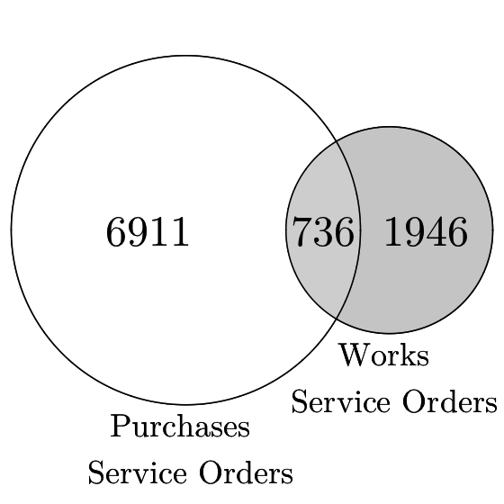

# (APPENDIX) Appendix {-}
# Appendix: Service Order Classification {#appendixA}
Service orders issued by CGU investigated different uses of public resources in addition to procurement, e.g. for officials compensation, for school activities, or for community monitoring of public policies. The discretion measure proposed here, however, is exclusive to procurement expenditures made under Law 8,666/93, thus we need to isolate service orders which investigated procurement processes from the rest. Since there is no such direct reporting in CGU reports, we implement a service order classification system based on the information retrieval and natural-language processing literatures.

We use each service order's description to identify if it is procurement-related. In these descriptions, CGU auditors report the purpose of their investigation, e.g. whether they are looking into painkiller purchases, whether the municipality has used the funds within designated goals, or whether primary school teachers were hired for the implementation of a school program. Using these textual descriptions as bag-of-words models, we implement a  method similar to that of @HopkinsMethodAutomatedNonparametric2009: we stem and combine unigrams to form search patterns that identify a service order as procurement-related. There are two broad types of procurement in Law 8,666/93: (i) ordinary procurement of goods and services, which we call *purchases*; and (ii) procurement of goods and services used for public works, which we call *works*. There are different search patterns for each type.

An example is useful for understanding our classification process. Unigram "aquisição" (*acquisition* in English) is stemmed to "aquisi" to form a search pattern for the *purchases*-type procurement; unigrams "adequação" and "habitacional" are stemmed and combined to form "adequa(.)\*habitac"^[All seach patterns are regular expressions.] search pattern for *works*-type procurement. The bigram picks up variations in main keywords as well as coding mistakes due to, for instance, multiple whitespace between the two unigrams or due to coding Portuguese special characters ("adequação" vs. "adequacao").

**Table A.1: Procurement Search Terms**

*\- insert figure 1: keywords here \-* 

The final list contains 19 *n*-grams for identification of purchases and 17 *n*-grams for works.^[One of these keywords in the works search pattern is an "exclusion keyword," which removes service orders that contain the "exclusion keyword" in their description from the sample found by the other 17 *n*-grams.] When any of these words is found, we include the service order into the purchases or the works group. Since all public works projects procure goods and services but not all public purchases are works-related, whenever the search patterns matches service orders to both groups, we include the service order only in the works group but not in the purchases group. Public works procurements are a subset of all public procurements in Brazilian municipalities. The search patterns here identify a total of 9,593 procurement-related service orders.

**Figure A.1: Service Order Mapping**

*\- insert figure 1: Venn Diagram here \-*
<!-- {width=50%} -->

As @GrimmerTextDataPromise2013a rightly point out, no text analysis algorithm is perfect and only relying on keyword matches could potentially lead to misclassification of service orders. Let us suppose that one description reads "expenditures made in accordance with primary education program." Using unigram "expenditure" would yield a match for this service order to the purchases group, but in fact auditors might be looking at bonus payments for high-performing teachers. These resources could also be directed for school construction. In the first case, the service order should not be have been included in any group because it does not carry any procurement component. In the second case, it should have also been marked as public works.

We address these classification issues in three ways: (i) using means comparison tests of match quality discussed in @AssumpcaotextfindDataDrivenText2018; (ii) comparing the performance of the same search patterns on another textual description for a subset of service orders; (iii) finally, comparing the results from the textual classification algorithm to that of procurement violations reported by CGU auditors. We discuss these three tests in turns in the following sections.

## Match Quality Measures {#quality1}
The first test on match quality is the means comparison test presented in @AssumpcaotextfindDataDrivenText2018, whose reasoning is simple. Increasing the number of procurement-related terms in the search pattern is not necessarily good practice as we increase the chance of misclassifying service orders as procurement when in fact they are not; words can take on different meanings depending on their contexts, so the more search terms we use the more likely type I error is. Ideally, we would want to use as few *n*-grams as possible while still identifying all possible procurement matches. In order to do this, what @AssumpcaotextfindDataDrivenText2018 thus suggests is pairwise means comparison tests between the samples identified by *n* vs. *n* - 1 keywords. This method translates into a check on whether the sample identified by one additional keyword is significantly better than the previous sample with one fewer term. The program developed by @AssumpcaotextfindDataDrivenText2018 does this for us and we report the results in the tables below:

**Table A.2: Purchases Search Results**

*\- insert table 2: Purchases Search Results here \-*

The search terms are sorted in descending order by the number of service orders they identify (column 1). Column 6 displays *p*-values for means tests across samples, where each mean is the sum of observations found by *any* of the search items before, and inclusive of, any particular row over the total number of observations.^[This is also known as an alternative search where all search conditions are connected by an "or" statement.] The means test thus compares whether the sample identified by any row is significantly different from the the sample identified by all rows before. For instance, the evidence presented in row four of table 2 is that the inclusion of search item "ve[íi]culo" significantly improves (at the 5% level) the identification of the purchases sample when compared to the sample which only includes the previous three search words.

**Table A.3: Works Search Results**

*\- insert table 3: Works Search Results here \-*

The works sample is a third of the size of the purchases group and two of its search items do not significantly identify a new sample ("saneamento" and "conclus[ãa]o"). Despite having positive individual finds reported in column 1, table A.3, the means test in column 6 suggests that these finds are not new service orders in addition to what had already been identified by the the previous search terms.^[The search without these terms (available upon request) yields 2,679 service orders, just three short of the total in table A.3. Nevertheless, we keep the two items in the search algorithm for additional tests discussed in section \@ref(quality2).]

Means tests are important to map out the relationship between search items, both within and across groups, but they do not tell us anything about the relationship between search items and their latent procurement groups. In other words, the search terms might be picking up groups that are internally consistent but that do not map onto the procurement types in Law 8,666/93. We discuss these issues in sections \@ref(quality2) and \@ref(quality3).

## Textual Descriptions {#quality2}

CGU service orders can best be described as investigations on the use of public resources transferred from the federal government to Brazilian municipalities. There are six transfer types and each service order investigates only one type at a time. Since the procurement categories set out in Law 8,666/93 apply to all public procurements at all government levels, transfer types are irrelevant for constructing our discretion measure. Nonetheless, one type of these transfers helps test our classification algorithm.

Federal grants (*convênios* in Portuguese) are narrow transfer agreements signed by the federal government, its agencies, states and municipalities for the delivery of governmental programs. They are voluntary, time-limited transfers implementing policies at the local level, such as vaccinations and the construction of community health clinics. The most important feature of these grants, however, is that each of them also has an individual textual description of its purpose, e.g. a tractor purchase for a rural community in a given municipality. Thus, for a subset of service orders that are investigations of the use of these federal grants by Brazilian municipalities, we have two different textual descriptions of resource use: CGU's, from their audit report, and the federal government's, available online at the Transparency Portal.^[http://www.portaltransparencia.gov.br/]

**Table A.4: Classification by Textual Descriptions**

*\- insert table 4 here \-* (merge purchases and works into one table)

There is a total of 3,868 service orders for which we have descriptions both from CGU and from the federal government. In table A.4, we report the results of the search algorithm both in the service order (row-wise) and the transfer (column-wise) descriptions. We evaluate the performance of the search algorithm by checking whether it assigns the same service order to the same procurement group *regardless of the description in which it searches for the key terms*. In other words, the smaller the number of times that the algorithm assigns any service order to a different group when it switches to another textual description, the better.

This is a particularly important point for the classification method proposed here. The means test conducted in section \@ref(quality1) provides internal consistency because it compares and checks whether more observations are matched when more search terms are included; the tabulation across descriptions here provides external consistency because it compares and checks if the classification algorithm is independent of search target (description). It resembles a false positive (type I error) test because we can roughly calculate the percentage of misclassification of service orders. In panel A, the service order description search assigns 1,556 to the purchases group, out of which 83 were not simultaneously assigned to the same group in the grant description search, yielding a 5.3% false positive rate. In panel B, the service order search marks 2,053 observations to the works group, where 404 are not simultaneously marked when the search is performed in the grant description (a 19.7% type I error rate).^[The inverse misclassification rates are also reassuring: false positives are 8.9% and 14.0% for purchases and works respectively when we first classify observations using grant descriptions and then move on to service order descriptions.]

## Procurement Violations {#quality3}

Though section \@ref(quality2) supports external validity by showing that the service order classification is consistent across textual descriptions, we run the last robustness check here using the actual procurement violations reported by CGU.

The findings reported by auditors are coded into 35 infractions of the use of public resources, nine of which violations of procurement rules and one violation of public works rules. Thus, we know with certainty that service orders for which there are any of the nine procurement violations (ten if public works) are in fact procurement-related and should be classified either as purchases, works, or both. As opposed to section \@ref(quality2), this resembles a false negative (type II error) test on yet another subset of observations for which certain infractions were reported.^[The reason why this is a type II error test, instead of type I, resides on the way the test samples are defined. In section \@ref(quality2), both sample assignments (by matching procurement keywords in the service order or grant description) can be the "correct" procurement sample against which the match on the alternative description might yield false positives. In this section, we know with certainty that the sample identified by procurement infractions is in fact the correctly identified sample, since there cannot exist a procurement violation where no procurement has occurred. It makes the unidentified observations false negatives because they should have been classified as procurement-related service orders. This sample is clearly underidentified, as there are many procurement-related service orders that simply followed Law 8,666/93 and thus carry no infraction, but still, within this subset of all CGU investigations, it provides us with a good conterfactual against which to test our classification mechanism.]

**Table A.5: Classification by Violation Code**

*\- insert table 5 here \-* (use procurement table, not split up by purchases or works. Explain why denominator is any procurement)

The total number of service orders with at least one procurement infraction is 3,775 (4,146 if we include the public works infraction), which is the sum of column 2 in table A.5, panels A and B. The false negative rate is 8.5% and 9.9%, respectively, for purchases-only and works procurements. This means that 319 and 344 service orders should have been classified as procurement by our textual search algorithm but were not.

Although no text analysis mechanism is perfect, the evidence presented here supports our choice of classification algorithm. The identification of procurement orders is internally consisntent (section \@ref(quality1)), there are very few incorrect assignments of service orders to procurement (section \@ref(quality2)), and the sample which was identified as procurement maps well onto the latent categories in the Brazilian procurement legislation (section \@ref(quality3)).
