# Motivation

Developing countries spend **US$820bn**\footnotemark \space per year on goods and services supplied by the private sector. Governments purchase medical supplies, school material, and construction services used to implement public policies.

\bigskip

Constituents thus have an interest not only on **what** goods and services governments are purchasing but also **how** governments are procuring such items.

<!-- 
\begin{itemize}

  \item<2-4> When will the town build better roads? 

  \item<3-4> Should the government ask for three budget proposals for a school project or just one?

  \item<4-4> How many insulin injections should be purchased given their expiry date and the number of people who need them?

\end{itemize} -->

\footnotetext{Estimate based on 2017 World Bank data.}

# Research Question

\begin{center}

\textit{Does the imposition of harder, stricter procurement rules for government expenditure reduce corruption and misallocation of public resources?}

\end{center}

\bigskip

**Context**

Random sample of 14,518 federal transfers to 1,139 Brazilian municipalities between 2004-2010:

\bigskip

- 9,593 transfers used for public procurement;

- 4,925 transfers used for paying wages, keeping programs running, etc.

---

**Hypotheses**

1. The imposition of harder, stricter procurement rules for public spending **reduces** corruption.

1. The imposition of harder, stricter procurement rules for public spending **reduces** the misallocation of public resources.

\bigskip

**Findings**

1. Stricter procurement rules have **no effect** on corruption.

1. Stricter procurement rules have only a **limited effect** on mismanagement.

# Empirical Strategy

**Regression discontinuity (RD)** design where the application of procurement rules follows a strict monetary schedule established by Law 8,666/93.

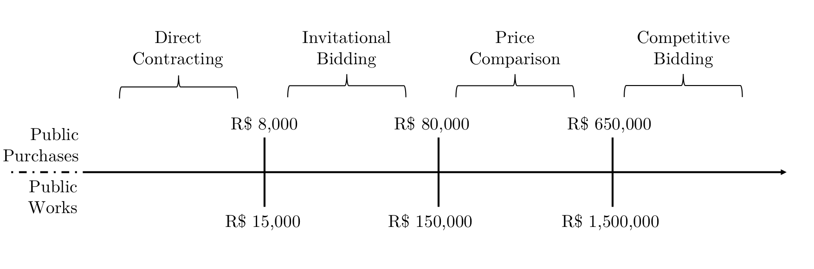

By looking at federal transfers whose values fall in the vicinities of the discontinuities in procurement rules, we identify the **causal effect** of discretion on government performance.

# Outcomes

The Office of the Comptroller-General (CGU) ran a random audit program of Brazilian municipalities expenditures between 2003 and 2015, which we use to code corruption and misallocation indicators serving as outcome variables in this project (Ferraz and Finan, 2008; 2011).

- **Binary:** whether the transfer contains evidence of corruption or mismanagement;

- **Share:** how many of each transfer's records are corruption or mismanagement-related;

- **Amount:** how much money was potentially lost to corruption or mismanagement.

In total, my preferred estimation yields 6 (outcomes) *x* [2 (purchases cutoffs) + 3 (works cutoffs) + 3 (pooled cutoffs)] = 48 parameter estimates.

# Results 

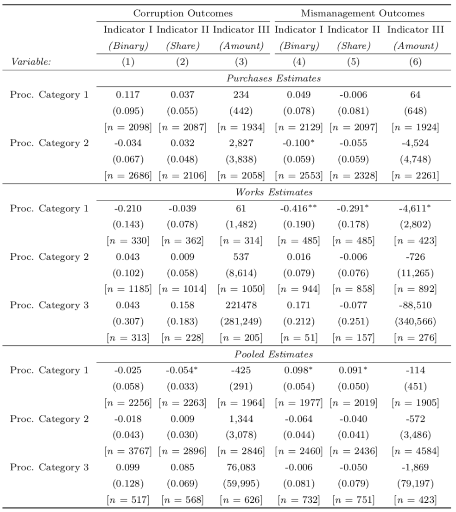{width=69%}

# Results 

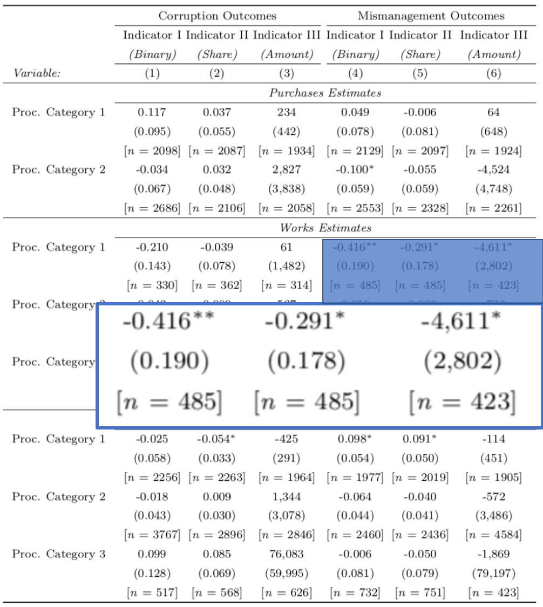{width=69%}

# Mismanagement Binary

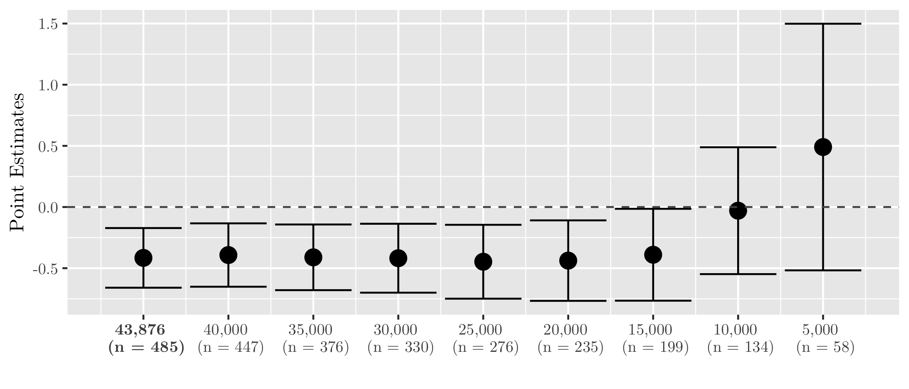

**Interpretation:** imposing stricter rules on bureaucrats when hiring private contractors in public works projects reduces the probability of finding mismanagement problems in these projects by **41.9 percentage points**.

# Mismanagement Share

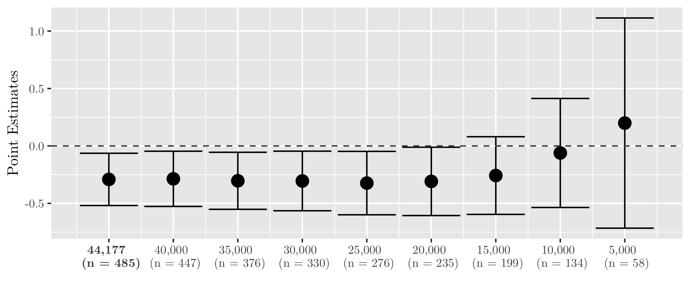

**Interpretation:** imposing stricter rules on bureaucrats when hiring private contractors in public works projects reduces the share of mismanagement problems found by auditors by **29.1 percentage points**.

# Mismanagement Amount

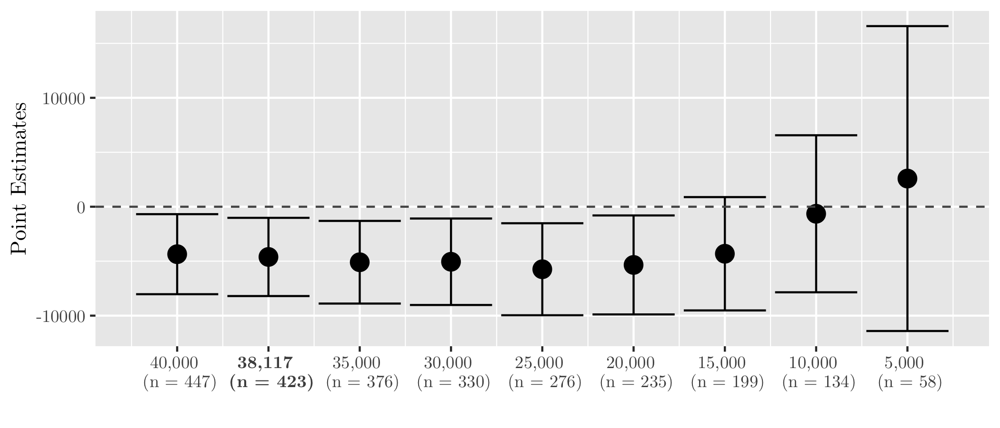

**Interpretation:** imposing stricter rules on bureaucrats when hiring private contractors in public works projects reduces the amount lost to mismanagement by **R$4,611** (**$1,155** using the current exchange rate).

# Results are robust!

1. We run covariate balance tests across cutoffs and include covariates in regressions.

2. We try different models (linear vs. quadratic, non-parametric RD).

3. We use robust standard errors, clustered at the municipal level, and health, education, and auditing fixed effects.

4. We run the McCrary (2008) test for manipulation of the running variable and throw away the last cutoff in the goods/services procurement type.

5. Optimal bandwidth selection comes from Calonico, Cattaneo, and Titiunik (2015), but we also run our local (quadratic) regressions at smaller bandwidths.

6. There are two falsification tests showing that our significant mismanagement effects are not spurious...

# Falsification Tests 1

Is this result spurious? Using **fake purchases** cutoffs for works transfers, the answer is **no**.

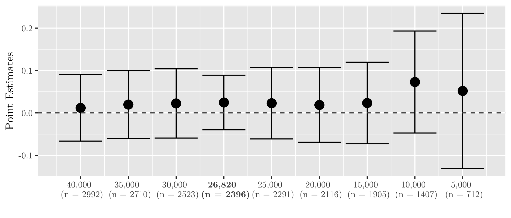

# Falsification Tests 2

Isn't this a feature of those transfers rather than a feature of procurement? Using **non-procurement** transfers, the answer is also **no**.

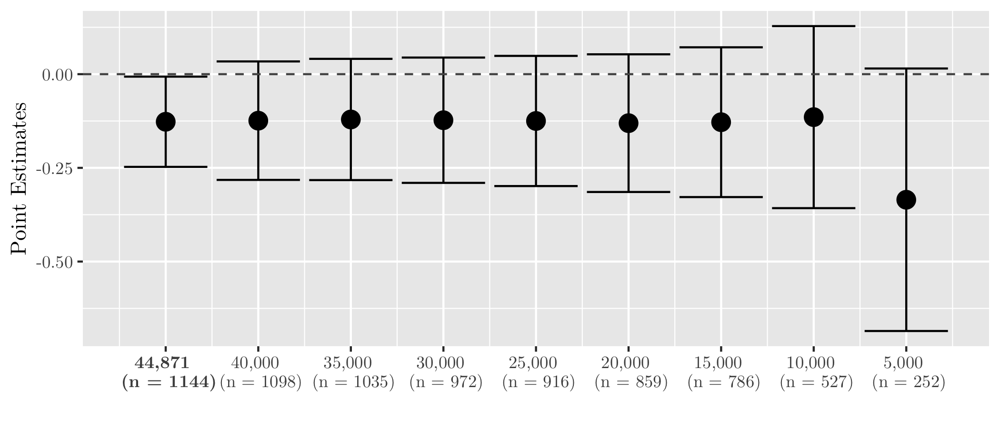

# Scientific Contribution

1. **No evidence that lower discretion** in public spending reduces corruption.

2. **Limited welfare effect:**  A back-of-the-envelope calculation shows limited effect of restricting procurement: Law 8,666/93 prevents only 5.98% of all observed misallocation of resources.

3. **Top-down legislation is ineffective:** legislation to limit discretion becomes meaningless with inflation and when bureaucrats adjust behavior to procurement rules.

4. Not discussed in this presentation... but we have also developed a text analysis algorithm to read in each transfer and assign it to procurement types (in appendix).

# Thank you!

Andre Assumpcao \
Ph.D. Candidate \
Department of Public Policy \
The University of North Carolina at Chapel Hill \
[https://aassumpcao.github.io](https://aassumpcao.github.io)

---

\begin{center}

\textbf{\large Supplemental Material}

\end{center}

# Summary Statistics

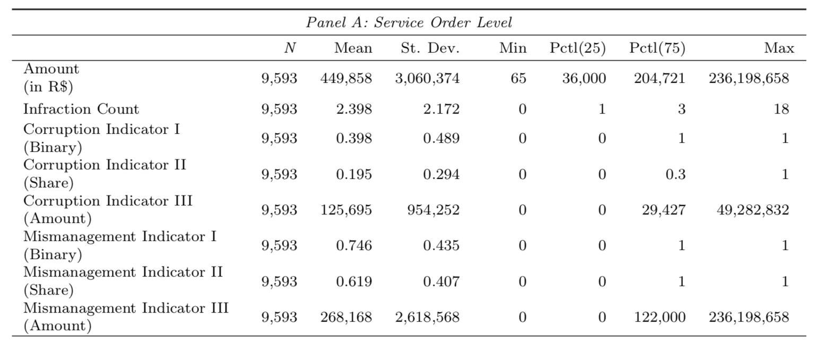

# Summary Statistics

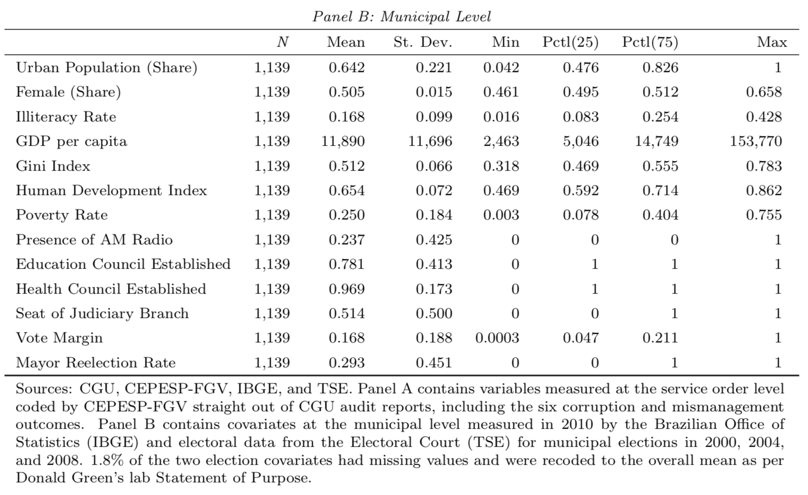

# Covariate Balance Tests

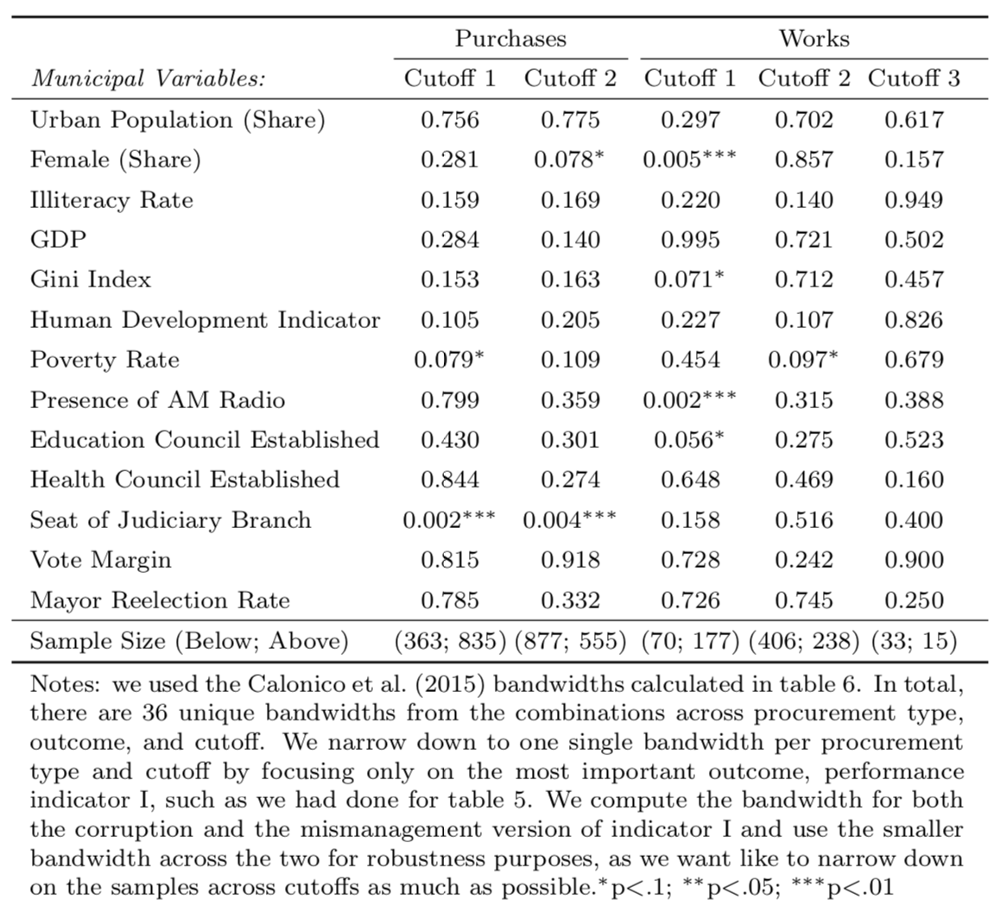{width=75%}

# Bandwidth Tests

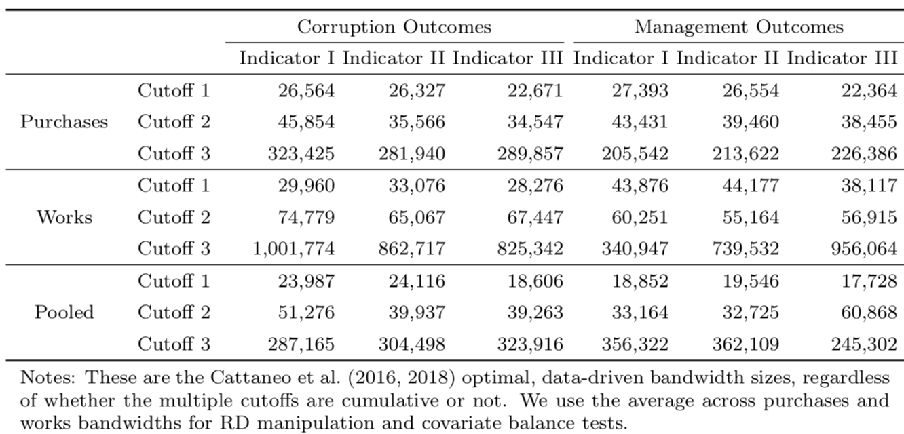

# RD Graphs

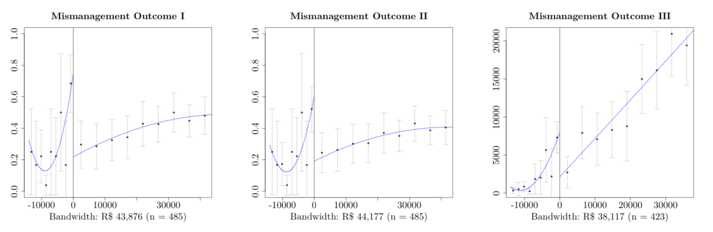{width=105%}

# Falsification Tests 1

Is this result spurious? Using **fake purchases** cutoffs for works transfers, the answer is **no**.

**Mismanagement Share**

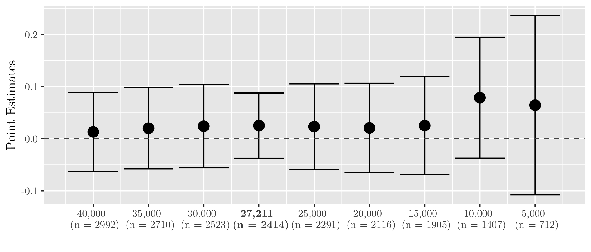

# Falsification Tests 1

Is this result spurious? Using **fake purchases** cutoffs for works transfers, the answer is **no**.

**Mismanagement Amount**

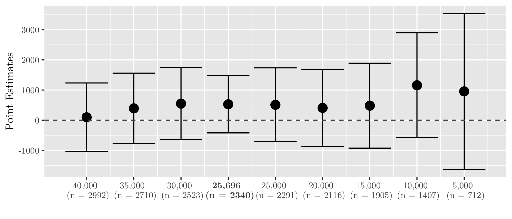

# Falsification Tests 2

Isn't this a feature of those transfers rather than a feature of procurement? Using **non-procurement** transfers, the answer is also **no**.

**Mismanagement Share**

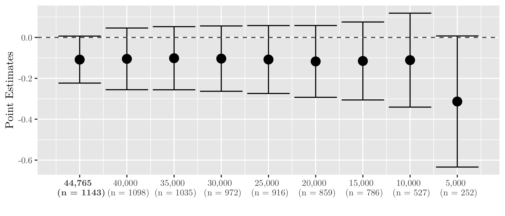

# Falsification Tests 2

Isn't this a feature of those transfers rather than a feature of procurement? Using **non-procurement** transfers, the answer is also **no**.

**Mismanagement Amount**

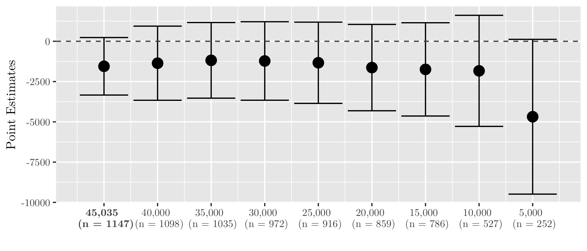

# Cost-Benefit Analysis

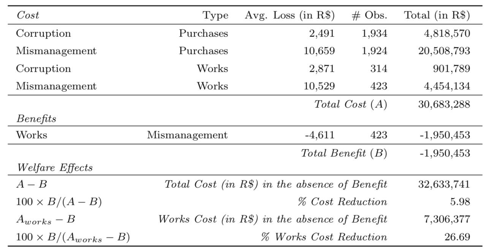

